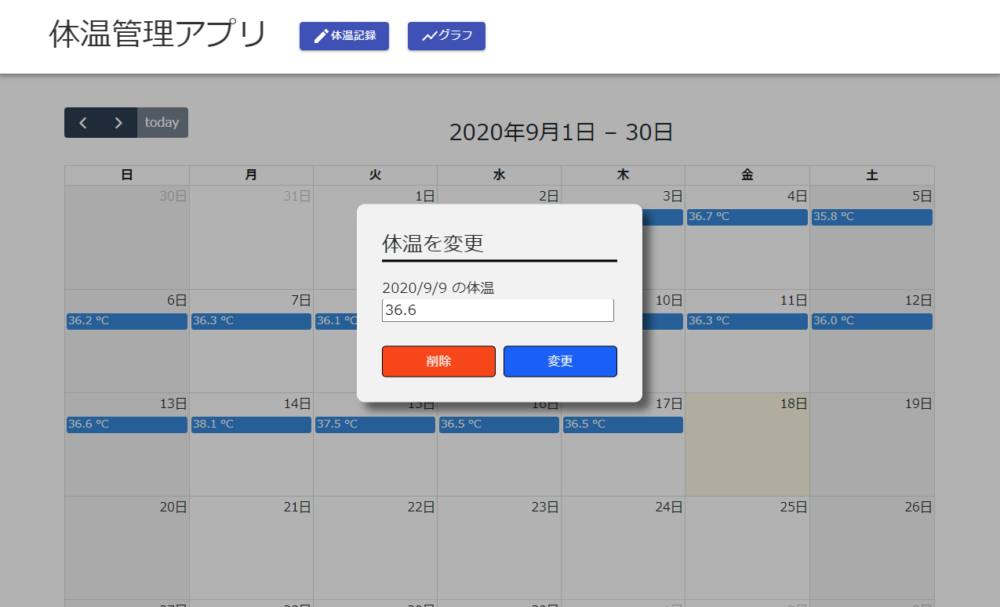

# 体温記録管理アプリ
体温記録アプリのサンプル

バックエンド： Spring Boot
データベース： MySQL 
フロントエンド： React 

### 利用手順
リポジトリのトップディレクトリで DB コンテナを起動する
```console
docker-compose up -d
```

エラーなく DB が起動できたら、バックエンドサーバに移動する。
```console
cd ./backend-spring-boot
```

#### バックエンドサーバを起動
```console
./gradlew bootRun
```

api につながることをブラウザで確認
```
http://localhost:8080/swagger-ui/index.html
```

エラーなくサーバを起動できたら、フロントエンドサーバに移動する。
```console
cd ./frontend-react
```

#### フロントエンドサーバ

##### Node モジュールをインストール
```console
yarn
```

##### フロントサーバを起動
```console
yarn start
```

##### ブラウザで確認
```
http://localhost:3000
```

体温記録画面  
http://localhost:3000  



体温変化グラフ表示画面  
http://localhost:3000/chart  


