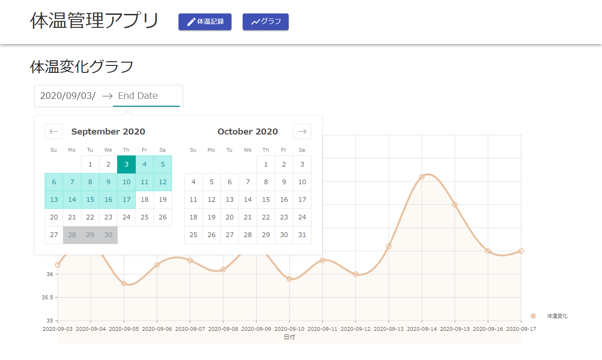

# 体温記録管理アプリ
体温記録アプリのサンプル

バックエンド： Spring Boot REST API サーバ  
データベース： MySQL 8.0  
フロントエンド： React JS  

### 利用手順
リポジトリのトップディレクトリで DB コンテナを起動する
```console
docker-compose up -d
```

※Docker 環境が手元にない場合は、以下を参照して用意してからコンテナを起動する

Docker Toolbox（レガシー Windows 向けです）：  
https://github.com/fs5013-furi-sutao/explain.how_to_install.docker_toolbox

エラーなく DB が起動できたら、バックエンドサーバに移動する。
```console
cd ./springboot-backend
```

#### バックエンドサーバを起動
```console
gradle bootRun
```

Gradle をインストールしていない場合は、
```console
./gradlew bootRun
```

api につながることをブラウザで確認
```
http://localhost:8080/api/v1/temperatures
```

DB の employees テーブルにデータを登録して、api から期待値が返ることを確認する。

```json
[
    {
        "id": 1,
        "date": "2020-09-09",
        "temperature": "36.5",
    }
]
```

エラーなくサーバを起動できたら、フロントエンドサーバに移動する。
```console
cd ./react-frontend
```

#### フロントエンドサーバ

##### Node モジュールをインストール
```console
yarn install
```

##### フロントサーバを起動
```console
yarn start
```

##### ブラウザで確認
```
http://localhost:3000
```

体温記録画面  
http://localhost:3000  


体温変化グラフ表示画面  
http://localhost:3000/chart  


